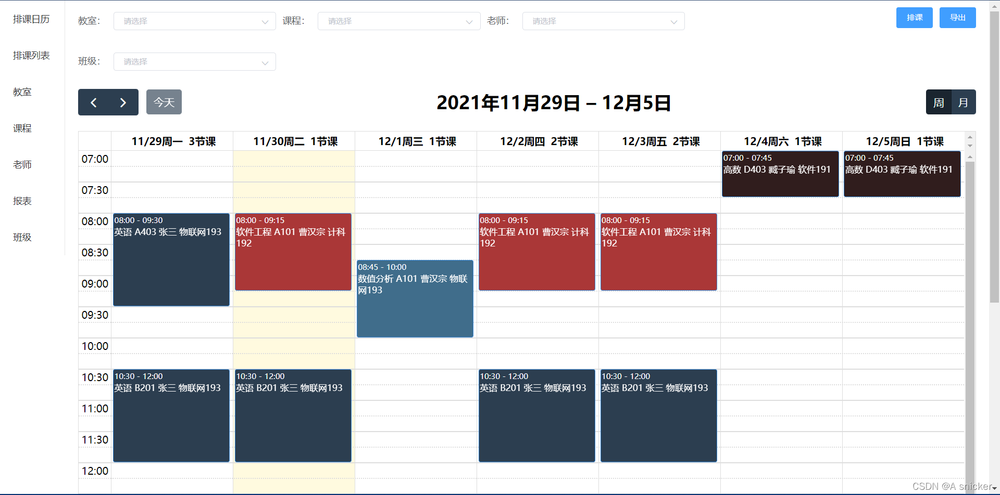
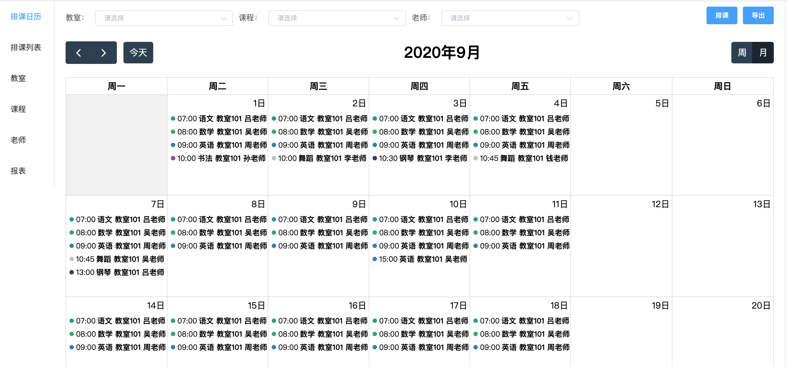
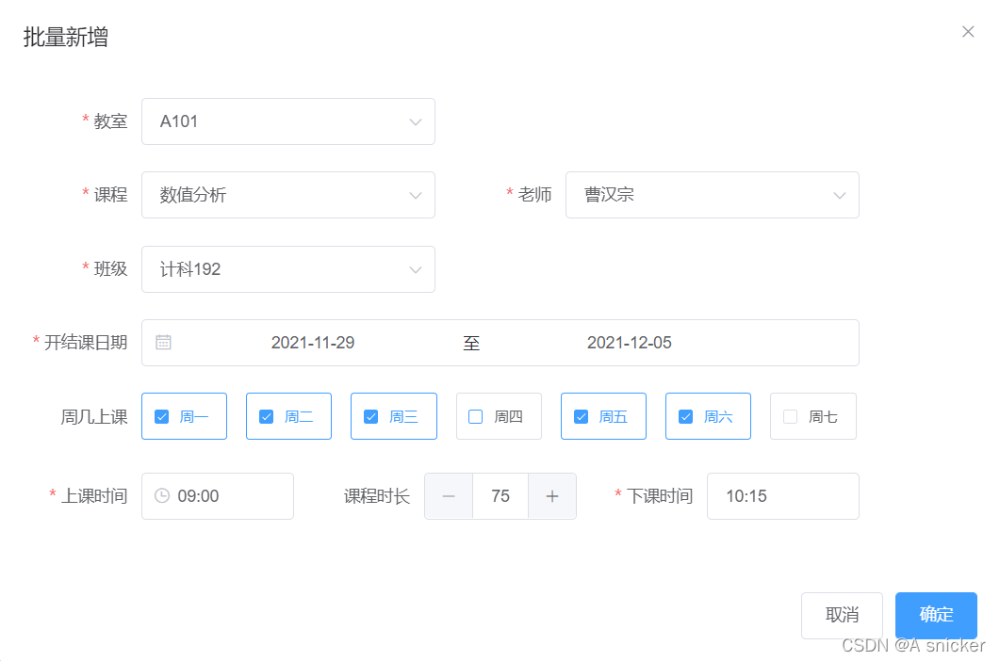
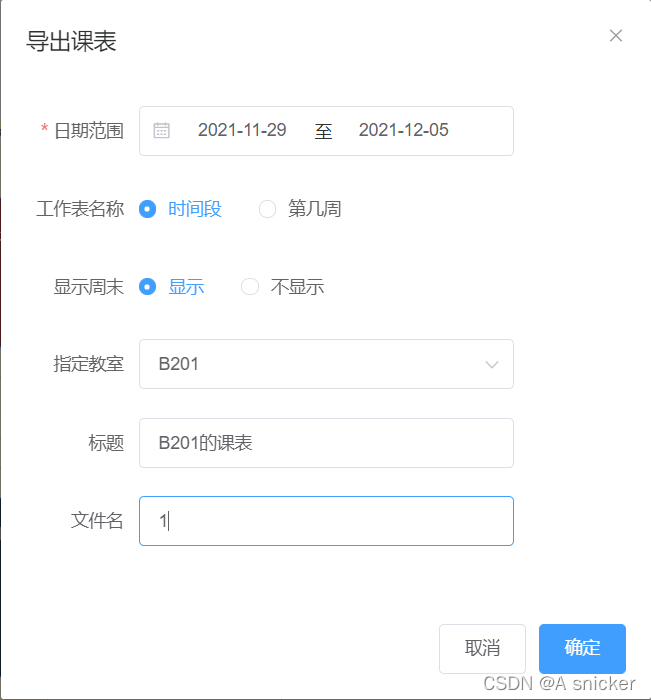
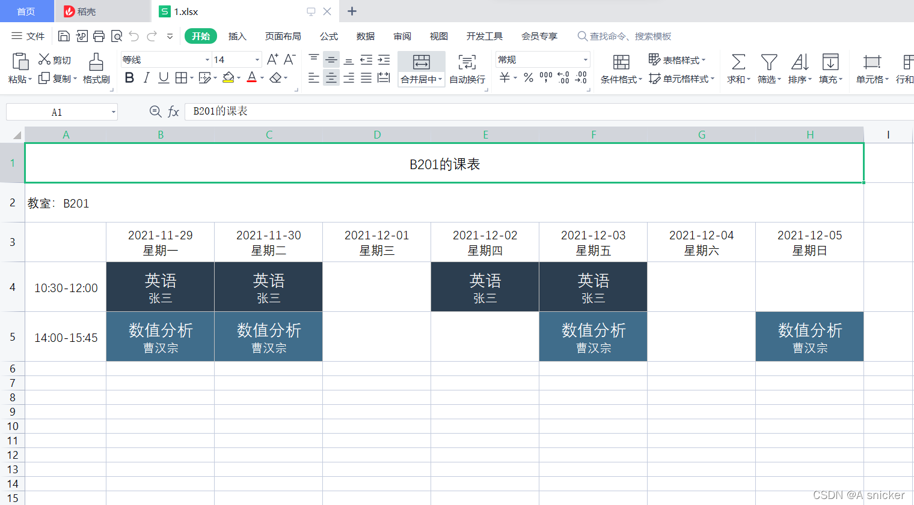
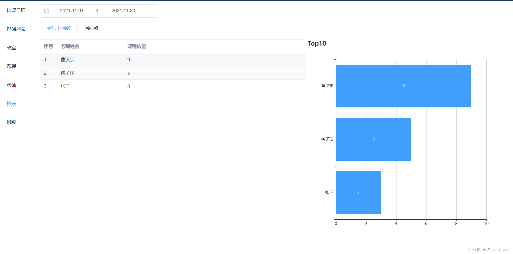

# 排课管理系统
排课管理系统是学校大三上学期的软件工程大实验的任务，本次实验时间匆忙，暂时参考了https://gitee.com/luhaidongxl/tams  的项目，采用vue+springboot开发。（在本项目的基础上，添加了班级的管理）

在项目最后上传了我们组的实验报告，其实没啥用。但是吧，写实验报告我感觉也是一件很有趣的事情。

## UI展示
### 排课







### 导出



### 报表统计


## 技术栈
### 前端
- vue 2.6
- vue-router 3.4
- vuex 3.5
- axios 0.19
- element-ui 2.13
- fullcalendar 5.3
- echarts 4.8

### 后端
- SpringBoot 2.3
- MyBatis-Plus 3.3
- Swagger2 3.0
- poi 4.1

## 运行
### 环境
- MySQL 5.7
- JDK 1.8
- Maven 3.6
- Node 12.14
- Yarn 1.21
### 前端
```bash
cd tams-web
yarn
yarn serve
```
### 后端
- 新建tams数据库，执行数据库脚本 db/init_ddl.sql db/init_dml.sql
- 修改数据库信息为自己的配置 `tams-server/src/main/resources/application-dev.yaml`
- 运行 `TamsApplication`

### 访问
- 首页 http://localhost:12011
- 接口文档 http://localhost:12010/swagger-ui/

## 部署
### 环境
- docker 19.03
- docker-compose 1.26
### 映射目录
- 日志 ～/tams/logs
- 数据库 ~/tams/mysql/data
### 初始部署
- 执行打包脚本 `sh/package.sh`
- 执行打包文件中的安装脚本 `install.sh`
- 访问地址
    - 首页 http://localhost:12010
    - 接口文档 http://localhost:12010/swagger-ui/

### 升级
- 执行要升级的数据库脚本
- 执行打包文件中的升级脚本 `upgrade.sh`

### 卸载
- 执行打包文件中的卸载脚本 `uninstall.sh`
